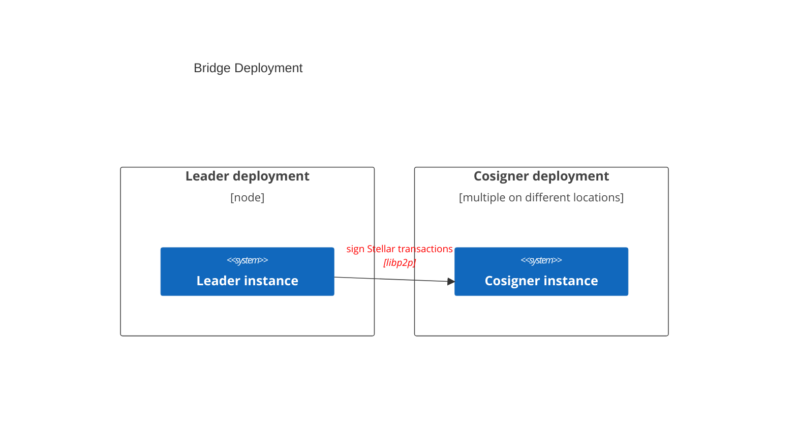
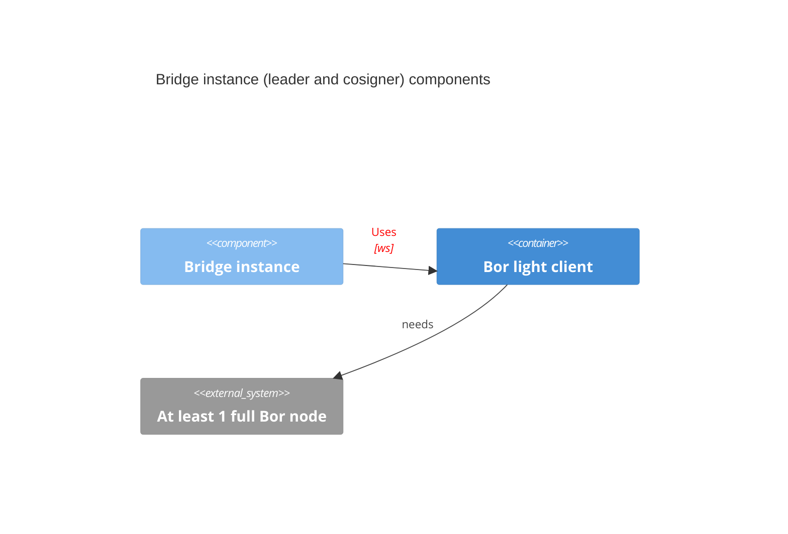

# Components

```mermaid
C4Deployment
title Bridge Deployment

Deployment_Node(location1,"Leader deployment"){
    System(leader,"Leader instance")
}
Deployment_Node(location2,"Cosigner deployment", "multiple on different locations"){
    System(cosigner,"Cosigner instance") 
}
Rel(leader, cosigner, "sign Stellar transactions", "libp2p")

UpdateRelStyle(leader, cosigner, $textColor="red",$offsetX="-60", $offsetY="-40")

```

```mermaid
C4Component

title Bridge instance (leader and cosigner) components

Component(bridge, "Bridge instance")
Container(bor, "Bor light client")
System_Ext(fullbor, "At least 1 full Bor node")

Rel(bridge, bor, "Uses", "ws")
Rel(bor,fullbor, "needs")

UpdateRelStyle(bridge, bor, $textColor="red",$offsetX="-20", $offsetY="-40")

UpdateRelStyle(bor, fullbor,$offsetX="-20", $offsetY="-10")
```
