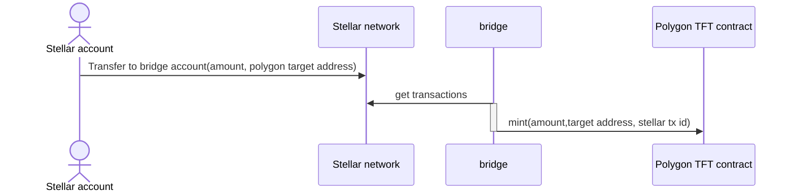
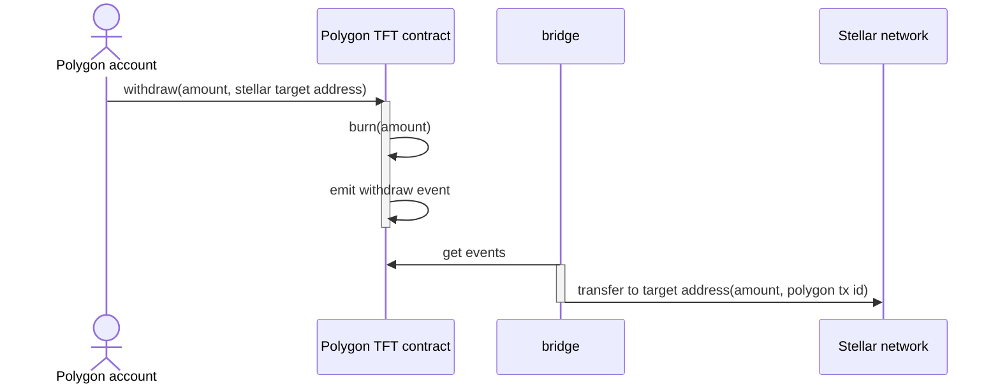

# Polygon-Stellar bridge

## Basic flows

### Stellar to Polygon

Since Stellar is the main chain, we call this a **deposit**.

### Polygon to Stellar

Since Stellar is the main chain, we call this a **withdraw**.

