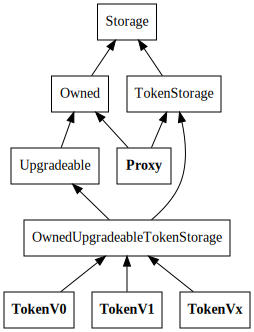

# TFT solidity implementation

The Solidity code is in the [contracts](./contracts) subdirectory

## Withdraw flow

Withdrawing tokens from the ERC20 contract back to TFT is attempted any time there is an action which modifies the balance of an account, or modifies the list of registered withdrawal addresses.
As such, there are currently 4 methods which might trigger a withdraw:

- [transfer](./contract/tokenV0.sol#L78)
- [transferFrom](./contract/tokenV0.sol#L110)
- [mintTokens](./contract/tokenV0.sol#L147)

When a withdraw occurs, a [withdraw event](./contract/tokenV0.sol#L40) is raised. The event includes the address from which the balance is withdrawn, as well as the amount of tokens which have been withdrawn, also the destination blockchain address and destination blockchain network is included. A bridge can listen to these events and return the tokens on the target blockchain to the target blockchain address and network.

High level, the withdraw flow works as follows:

When the withdraw action is called, it removes the exact amount from the target address balance and emits a Withdraw event for this exact amount.

## Multisig contract setup

### Motivation

Following methods on the token contract can only be called by the owner of the token contract:

- [mintTokens](./contract/tokenV0.sol#L147)
- [upgradeTo](./contract/upgradeable.sol#L52)

To make sure these methods can only be called in an ethical and distributed way, we decided to work with a multisig contract. The multisig contract address will be the owner of the TFT token contract.
When a `mintTokens` or `upgradeTo` must happen, one of the owners of the multisig contract can start a transaction and ask for approval of the other owners of this multisig contract. Once enough approvals have been submitted, the transaction is executed. The amount of confirmations needed is a configurable value on the multisig contract.

This is particulary good for a token bridge. Calls to `mintTokens` can happen in a fair and distributed manner without requiring human intervention.

We also harden security of the token contract in the case that one of the keys are compromised. If that happens we can identity which key that is and remove that key as an owner of the multisig contract and replace it with another.

### Building

[readme](./multisig/README.md) explains how to build the multisig contract.

## Proxy Contract setup

### Motivation

EVM contracts are autonomous immutable code. Once deployed  they are essentially set in stone. This means that if a serious bug or issue appears and your contracts are not designed in a way that will allow them to be upgraded seamlessly, you're screwed.

To solve this we made two crucial design choices:

- All main contracts must be upgradable;
- Have a flexible, yet simple way to store data permanently.

### Setup

The problem with a contract proxy is that the proxy does not actually call the implementing contract. Instead,
it loads the function code and executes it in it's own storage space. This means that the storage needs to be
defined in the proxy as well, and the storage layout needs to be the same.

The two main contracts here are Proxy and tokenV0..Vx

**tokenV0..Vx** are the actual upgradeable implementations

**Proxy** is the contract that will be called by the users. It delegates all calls to the current tokenV0..Vx implementation. The method are not defined here , every call it receives is delegated so if the implementation adds functionality, this contract does not have to be upgraded.
This way , the address of the deployed TokenProxy never changes.

helper contracts:

- Storage defines the storage layout
- TokenStorage exposes storage helpers for the ERC20 token (balances, allowances, ...). It also has the token constructor which sets some general variables (name, precision, ...)
- Proxy provides the functionality to delegate any unknown method to an embedded contract address
- Owned allows us to have the notion of "owners", and adds a modifier to methods which ensures that only addresses in the owner list can call them.
- Upgradeable adds the upgrade logic, and stores the address and version of the currently used token contract. Note that this contract is only extended from by the tokens,
    even though these do not use the upgrade logic themselves. This way the proxy does not need to be aware of the actual token upgrade logic, which allows the upgrade logic itself
    to be upgradeable.
- OwnedUpgradeableTokenStorage extends from Upgradeable and TokenStorage. This includes all the required components
  for the owned, upgradeable token. (No actual implementation, only inheritance)
  The specific token contracts extend from OwnedTokenStorage, so they all have the same memory structure

### Important

There is only a single contract which actually defines a storage layout: `Storage`. All other contracts which inherit from this and have
their own storage requirements actually use getters and setters which access the storage. The storage structure is defined as a key-value store
for all available primitive types. The key is defined as a `bytes32` type, in practice we use a `keccak256` hash.

## Building

A `compile.sh` script is present in the contract folder to compile the contracts.

The solidity compiler (`solc`) is required.
Please read <https://solidity.readthedocs.io/en/v0.5.2/installing-solidity.html> to know how to install this compiler, should you not have installed it already.

### Deployment

There are two main contracts which need to be deployed: `Proxy` and the actual token implementation (`TokenV0`). The token contract needs to be deployed first, so the `Proxy`
constructor can set the initial address of said contract. After that, contract upgrades can be done by using the `upgradeTo` method which is inherited by the actual Token. Once the
`Proxy` has been deployed, new owners can also be added to it (also via proxied calls to the `Token` contract), who will be allowed to add other owners, change the `Token` contract,
and call protected methods on said contract.
